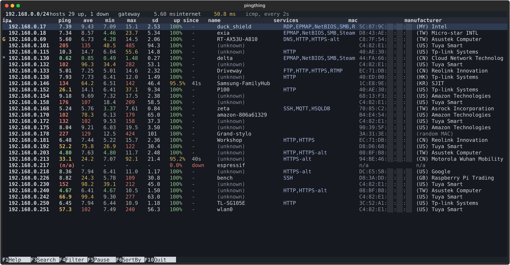

# pingthing

The goal is an **htop for your home LAN.** A live, at-a-glance view of every device on your local network: who is up, how fast they
answer, how steady that is, and what they are.

I built this because I needed to inspect my own network, and the tools for it were either inadequate or overly
cumbersome. pingthing needs no configuration: run it, and it finds your network and starts watching.

> [!WARNING]
> This util does port scanning and network discovery. If you run it on a corporate network, your IT department will
> probably be unhappy with you.

## Features
- **Live latency per host.** Last, average, best, worst and standard deviation, colour coded, updated every couple of
  seconds.
- **Uptime and outages.** Percent of pings answered, and how long since a host last dropped out (or how long it has
  been down).
- **Device identification.** Host names, and the manufacturer from the MAC address using the IEEE register.
- **Port summary.** A quick scan of the 1% of ports you need to know 99% of the time.
- **Internet and gateway latency** in the summary line, so you can tell a slow device from a slow connection.
- **htop style keys.** Search, filter, pause, sort by any column, mouse support.
- **Host inspector.** A latency graph and histogram, a full 65535 port TCP scan and traceroute.
- **Accessible.** A black and white mode (--bw).

## Install

Needs Python 3.11 or newer.

    # with uv
    uv tool install git+https://github.com/busyDuckman/pingthing

    # or with pipx
    pipx install git+https://github.com/busyDuckman/pingthing

Then run `pingthing`. Press F1 for help, q or Esc to quit.

## Usage

It finds your local network by itself, or you can give it one.

    pingthing [--range RANGE] [--time_out SECONDS] [--interval SECONDS] [--view COLUMNS] [--internet ADDRESS]
              [--no-ports] [--screen-shot] [--bw]

| Option | |
|---|---|
| `--range RANGE` | network to watch, eg: 192.168.0.0/24 (default: detect the local network) |
| `--time_out SECONDS` | time out for each ping (default: 1) |
| `--interval SECONDS` | seconds between pings to each host (default: 2) |
| `--view COLUMNS` | columns to show, from: flag, ip, ping, mean, best, worst, sd, up-time, last-outage, name, services, mac, manufacturer |
| `--internet ADDRESS` | address to ping as a measure of internet latency, 'off' to skip (default: 1.1.1.1) |
| `--no-ports` | don't scan hosts for common services |
| `--screen-shot` | mask MAC addresses and host names, for sharing screenshots |
| `--bw` | black and white mode (colour blind safe) |

Ping times are in milliseconds. In the first column, G marks your gateway and * marks this machine.

### Keys

| Key | |
|---|---|
| Up, Down, PgUp, PgDn, Home, End | move the selection |
| Enter or click | details for the selected host |
| F1 or ? | help |
| F3 or / | search (F3 again for the next match) |
| F4 or \ | filter the table |
| F5 | rescan names, MAC addresses, ports and the network |
| F7 or Space | pause the display (pinging carries on) |
| F6 or >, or click a heading | sort |
| Esc | close a window or clear the filter, otherwise quit |
| F10 or q | quit |

In the host window: Left and Right (or g, p, t) switch between the latency graphs, a full port scan and traceroute;
c copies the address and w opens its web page.

## How it works

Everything runs on a single asyncio event loop, so hundreds of probes can be in flight at once without threads or
processes.

- **One ICMP socket for every ping.** Replies are matched to requests by sequence number.
- **Pings are spread out, not sent in bursts.** Each host gets its own slot in the ping interval, stepped by the
  golden ratio so the slots stay evenly spread however many hosts turn up.
- **Discovery is gentle.** The first sweep covers the network quickly; after that, unseen addresses are retried a
  chunk at a time.
- **Slower lookups run in the background** with their own limits: names via the resolver, MAC addresses from the OS
  ARP table, and port checks via non-blocking connects.
- **Falls back gracefully.** Unprivileged ICMP, then raw ICMP, then the system ping command, parsed per OS.

The monitor owns the data and the UI only reads it, so the [Textual](https://github.com/Textualize/textual)
interface stays responsive.

**Note:** Ping times are accurate to about 1ms as they are measured in Python rather than by the OS.

## Design goals

- No configuration files and a simple install.
- At a glance view of current, best, worst and average ping.
- It's non-standard, but I personally think the standard deviation of pings is a really useful "at a glance" way to
  spot problems with IoT devices. It also lets you spot mobile devices that put their network card to sleep.
- Port scan only the 1% of ports 99% of people care about.
- Decide what information is useful, not "shop for stuff to show".

## Development

Uses [uv](https://docs.astral.sh/uv/) and [just](https://github.com/casey/just).

    just run      # run from source
    just test     # run the tests
    just --list   # everything else

CI runs the linter and tests on Linux, macOS and Windows with Python 3.11 and 3.13. The roadmap is in
[.plans/refresh.md](.plans/refresh.md).

## References

- MAC data from the [IEEE OUI register](https://standards-oui.ieee.org/oui/oui.csv)
- [Textual](https://github.com/Textualize/textual) [MIT]
- [icmplib](https://github.com/ValentinBELYN/icmplib) [LGPL-3.0]
- [psutil](https://github.com/giampaolo/psutil) [BSD-3-Clause]
- [get-mac](https://github.com/GhostofGoes/getmac) [MIT]

## Licence

MIT, see [LICENSE](LICENSE).
